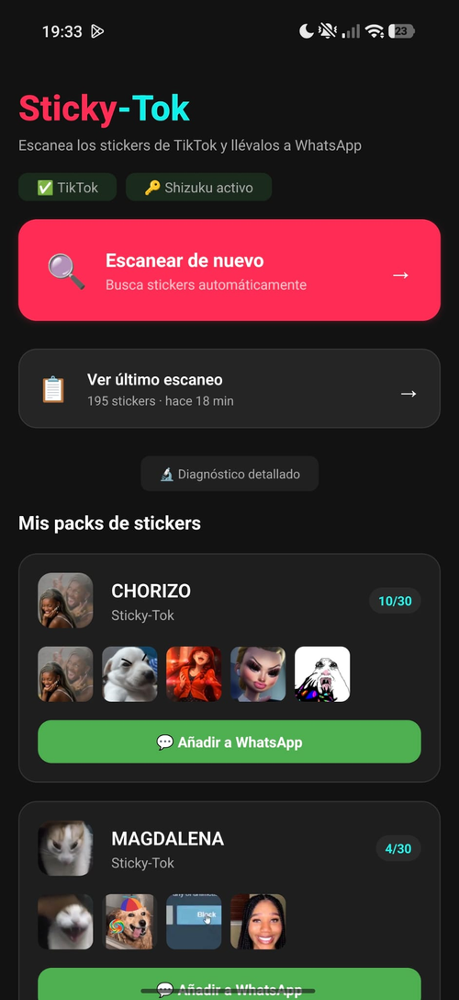
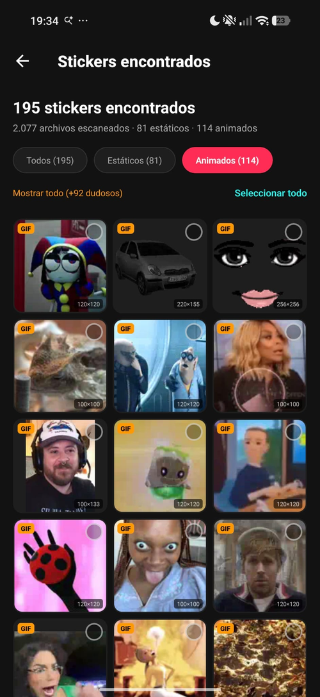
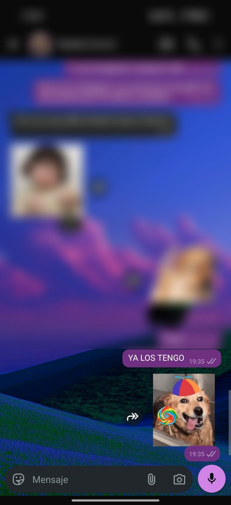
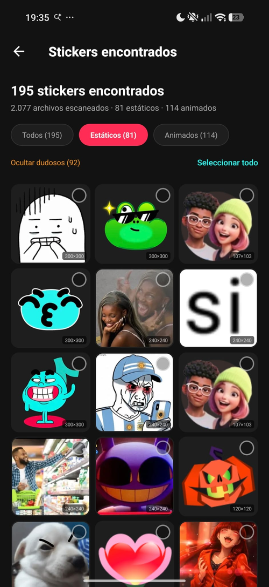

  

<h1 align="center">Sticky-Tok</h1>

  Convierte los stickers de TikTok en paquetes de stickers para WhatsApp.

  
  
  

  
  
  

 

  <strong>¿Quién no ha querido tener sus increíbles stickers de TikTok en WhatsApp?</strong>

  Es el deseo de media comunidad de TikTok… y Sticky-Tok viene a cumplirlo. 
  Con esta app, ahora <strong>YA PUEDES</strong>. 🎉

  

---

## ¿Qué es?

Sticky-Tok es una app de Android que **rescata los stickers que usas en TikTok y los lleva a WhatsApp**. Escanea la caché de TikTok en busca de los stickers reales (animados y estáticos), te deja elegir cuáles quieres y crea paquetes listos para añadir a WhatsApp con un toque — respetando los requisitos exactos de WhatsApp (512×512, tamaño y límites por paquete).

Lo más difícil ya está resuelto por dentro: los **stickers animados se conservan en movimiento** y se reescalan a pantalla completa sin recortarse, y el escáner **filtra el ruido** (fotos de perfil, banners, reacciones del sistema, iconos de la interfaz) para mostrarte solo tus stickers de verdad.

## Funciones

### 🔍 Escaneo inteligente de la caché de TikTok
Encuentra los stickers reales que has usado en los chats de TikTok. Un filtrado por rutas, tamaño y transparencia descarta fotos de perfil, portadas, banners, reacciones del sistema y iconos de la app, para que no se mezclen con tus stickers.

  

### 🎬 Stickers animados en movimiento
Los stickers animados se adaptan a 512×512 **preservando la animación** y se reproducen en bucle en WhatsApp. Se reescalan a tamaño completo (sin recortar) para que se vean grandes, no diminutos en una esquina.

  

### 👀 Previsualización dentro de la app
Mira cómo se mueven tus stickers animados **dentro de la propia app** antes de mandarlos a WhatsApp.

### 🧩 Paquetes por tipo, con división automática
Elige **Solo animados** o **Solo estáticos** (WhatsApp no permite mezclarlos en un mismo paquete). Si seleccionas más de 30 stickers, Sticky-Tok crea **varios paquetes automáticamente**.

### 📊 Progreso en tiempo real y caché de resultados
Una barra de progreso te muestra el avance del escaneo con el número de stickers encontrados. Los resultados se guardan: puedes volver a **"Ver último escaneo"** sin repetirlo, o **"Escanear de nuevo"** cuando consigas stickers nuevos.

### 🎯 Filtro de confianza
Cada resultado se clasifica por confianza. Por defecto se ocultan los dudosos, con la opción de **"Mostrar todo"** si quieres revisarlos.

  

## ¿Cómo funciona?

1. **Usa stickers en TikTok** — en un chat (Mensajes directos), envía o recibe los stickers que quieras. Así se guardan en la caché.
2. **Escanea** — abre Sticky-Tok y pulsa *Escanear TikTok*.
3. **Elige** — selecciona tus stickers favoritos de la cuadrícula.
4. **Crea el paquete** — ponle nombre, elige animados o estáticos, y créalo.
5. **Añádelo a WhatsApp** — un toque y ya está.

> ℹ️ **Ten en cuenta**
>
> Sticky-Tok es un proyecto personal y puede tener fallos. El filtrado que separa tus stickers del resto de imágenes de la caché **no es perfecto**: puede que algún sticker no aparezca, o que se cuele alguna imagen que no lo es. Si echas en falta alguno, pulsa **"Mostrar todo"** para ver también los clasificados como dudosos.

## Requisitos

- **Android 11 o superior**
- **[Shizuku](https://shizuku.rikka.app/)** — necesario para acceder a la caché de TikTok en Android 11+ (la propia app te guía para instalarlo y activarlo, es gratis).
- **TikTok** instalado, con stickers usados en chats.
- **WhatsApp** o **WhatsApp Business** instalado.

## Descarga

  

Descarga el **APK** desde la [última release](https://github.com/agm22profesionalmail-dot/Sticky-Tok/releases/latest) e instálalo en tu móvil.

> ⚠️ **Nota sobre "Fuentes desconocidas"**
>
> Al ser una app fuera de Google Play, Android te pedirá permitir la instalación desde tu navegador o gestor de archivos. Es un paso normal para apps instaladas manualmente (sideload): acepta *"Instalar de todas formas"* / *"Permitir de esta fuente"* cuando aparezca.

---

  Hecho con ☕ por <strong>Zero</strong> · Proyecto personal, sin ánimo de lucro.

  <em>Sticky-Tok es un proyecto independiente y no oficial. 
  No está afiliado, patrocinado ni respaldado por TikTok, WhatsApp, Meta 
  ni ninguna otra marca mencionada. Todos los nombres de productos y marcas son 
  propiedad de sus respectivos titulares y se usan únicamente con fines descriptivos. 
  Usa la app únicamente con stickers sobre los que tengas derechos. El uso queda bajo la responsabilidad del usuario.</em>

